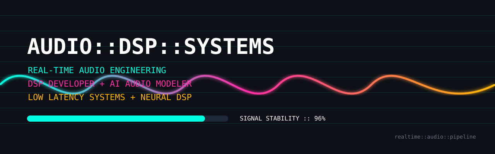

<div align="center">



<br><br>

# <font color="#ff2ea6">AUDIO::DSP::SYSTEMS</font>

<kbd>REAL-TIME AUDIO ENGINEERING</kbd>
<kbd>LOW-LATENCY DSP</kbd>
<kbd>AI AUDIO MODELING</kbd>
<kbd>VST3 PIPELINES</kbd>

<br><br>

```text
╔══════════════════════════════════════════════════════════════╗
║                 SYNTHESIS CONTROL TERMINAL                  ║
╠══════════════════════════════════════════════════════════════╣
║ ROLE        :: Audio Developer / DSP Engineer               ║
║ DOMAIN      :: Real-Time Systems + AI Audio Processing      ║
║ ARCHITECT   :: Low-Latency Runtime Design                   ║
║ SIGNAL PATH :: Hardware ↔ DSP ↔ Neural Inference            ║
║ STATUS      :: ACTIVE                                       ║
╚══════════════════════════════════════════════════════════════╝
```

</div>

---

<table width="100%" bgcolor="#0d1117">
<tr>
<td>

## <font color="#00ffe1">SYSTEM::OVERVIEW</font>

Building real-time audio systems where  
traditional DSP meets neural inference.

Focused on:

- Ultra low-latency audio architectures
- Frequency-domain DSP engines
- JUCE-powered VST pipelines
- Hardware audio routing systems
- Neural denoising integration inside C++ runtimes
- AI-assisted spectral enhancement workflows

I engineer systems that behave more like hardware racks than software apps.

</td>
</tr>
</table>

---

<table width="100%" bgcolor="#0d1117">
<tr>
<td>

## <font color="#ff2ea6">MASTER_PROJECT::Adaptive Audio Denoiser Engine</font>

```text
PHASE_01 :: CLASSICAL DSP
---------------------------------------------
Input Signal
    ↓
STFT / Frequency Domain Transform
    ↓
Spectral Subtraction Engine
    ↓
Dynamic Vocal Phase Isolation
    ↓
Noise Profile Attenuation
    ↓
Real-Time JUCE Buffer Processing
    ↓
Output Stream
```

```text
PHASE_02 :: NEURAL DSP MIGRATION
------------------------------------------------
Current Direction:
DeepFilterNet-inspired lightweight inference
RNN-style temporal filtering structures
Real-time streaming neural enhancement
Optimized CPU-safe runtime deployment
C++ inference bridge experimentation
```

</td>
</tr>
</table>

---

<table width="100%" bgcolor="#0d1117">
<tr>
<td width="50%">

## <font color="#ffb703">DSP::CONTROL_PANEL</font>

### `GAIN::C++ (JUCE Framework)`

```text
[█████████████████░░░] 88%
```

### `THRESHOLD::DSP Engine`

```text
[██████████████████░] 90%
```

### `DRY_WET::Python + ML`

```text
[███████████████░░░░] 75%
```

</td>

<td width="50%">

## <font color="#00ffe1">ACTIVE::MODULES</font>

<kbd>C++</kbd>
<kbd>JUCE</kbd>
<kbd>VST3 SDK</kbd>

<br><br>

<kbd>DSP</kbd>
<kbd>FFT</kbd>
<kbd>Spectral Math</kbd>

<br><br>

<kbd>PyTorch</kbd>
<kbd>NumPy</kbd>
<kbd>Python</kbd>

<br><br>

<kbd>Git</kbd>
<kbd>VS Code</kbd>
<kbd>FL Studio</kbd>
<kbd>Figma</kbd>

</td>
</tr>
</table>

---

<table width="100%" bgcolor="#0d1117">
<tr>
<td>

## <font color="#ff2ea6">LOW_LEVEL::STACK</font>

```text
Audio Runtime Layer
├── C++17
├── JUCE Core
├── VST3 SDK
└── Real-Time Thread Management

Signal Processing Layer
├── Spectral Analysis
├── Frequency-Domain Processing
├── Dynamic Filtering
└── Buffer Synchronization

Neural Audio Layer
├── Python Prototyping
├── NumPy
├── PyTorch
└── Lightweight Inference Exploration

Creative Environment
├── FL Studio
├── VS Code
├── Git
└── Figma
```

</td>
</tr>
</table>

---

## <font color="#00ffe1">CURRENT::FOCUS</font>

```text
> optimizing neural denoising for real-time playback
> reducing inference latency inside JUCE runtimes
> spectral enhancement + phase recovery experiments
> hybrid DSP + ML processing architectures
> hardware-aware audio routing systems
```

---

<table width="100%" bgcolor="#0d1117">
<tr>
<td>

## <font color="#ffb703">REALTIME::PIPELINE</font>

```text
MIC_INPUT
   │
   ▼
[ AUDIO DRIVER ]
   │
   ▼
[ JUCE CALLBACK ]
   │
   ▼
[ FFT WINDOW ]
   │
   ▼
[ SPECTRAL PROCESSING ]
   │
   ├── Noise Reduction
   ├── Phase Recovery
   ├── Harmonic Analysis
   │
   ▼
[ OPTIONAL ML INFERENCE ]
   │
   ▼
[ LOW LATENCY OUTPUT ]
```

</td>
</tr>
</table>

---

<table width="100%" bgcolor="#0d1117">
<tr>
<td>


<div align="center">

## <font color="#ff2ea6">ROUTING::CHANNELS</font>

<kbd>LINKEDIN</kbd>

```text
https://linkedin.com/in/your-profile
```

<br>

<kbd>MAIL</kbd>

```text
your.email@domain.com
```

<br><br>

---

</div>
